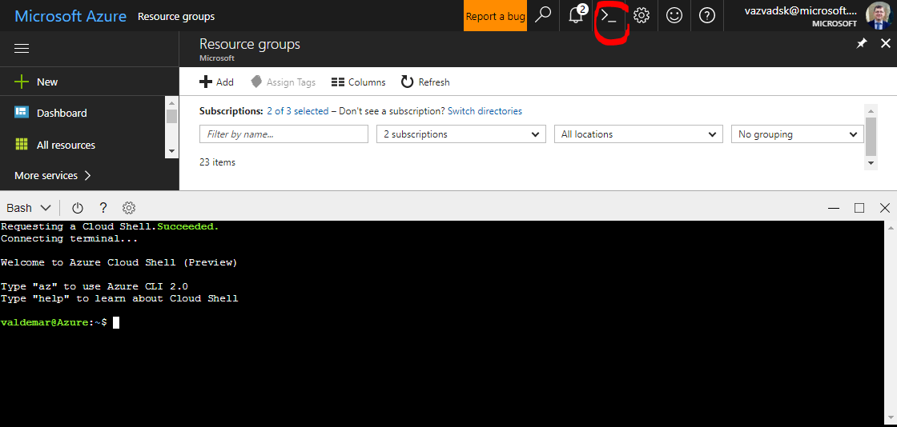

# AKS playground - Kubernetes (AKS), ACR, helm

This demo contains helm templates and description of k8s use-cases which can be used with any dockerized services (linux based containers).

## Prerequisites
 * installed "Bash on Ubuntu on Windows"
 * installed docker for windows
 * installed Azure CLI in Bash on Ubuntu - https://docs.microsoft.com/en-us/cli/azure/install-azure-cli-apt?view=azure-cli-latest 
 * installed helm in Bash on Ubuntu on Windows" - https://github.com/kubernetes/helm/blob/master/docs/install.md 

## Demonstrated scenario:
* automatically create infrastructure environment AKS (kubernetes), ACR.
* kubectl deployments
* kubectl autoscaling
* ingress controllers
* helm 

### Install infrastructure
Use azure CLI for installing component (or you can use Azure portal - graphical user interface for this task).

```bash
# login to Azure
az login

# create resource group
az group create --name MYAKS --location westeurope

# create AKS cluster
az aks create --resource-group MYAKS --name myaks

# create Azure Container Registry
az acr create -n myaksacr0001 --resource-group MYAKS --location westeurope --admin-enabled true --sku Basic

# collect credentials from Azure
az aks get-credentials --resource-group MYAKS --name myaks
```

### (optional) Solution can be provisioned by this simple script from Azure Cloud Shell:
* run Azure Cloud Shell
* 
* There run install script and provide necessary parameters
* `curl -s https://raw.githubusercontent.com/valda-z/aks-playground/master/run.sh | bash -s -- --resource-group KUBE --kubernetes-name valdakube `
* supported parameters are:
 * Mandatory
     * `--resource-group` - Azure resource group name (will be created by script)
     * `--kubernetes-name` - Unique name for kubernetes cluster 
 * Optional (if not provided than script uses defaults - see script)
     * `--location` - Azure region for resource group and all resources 

### After successful deployment:
* deployment script will show necessary information how to access our micro-service application

There is sample output - please store DNS name for service [APP DNS NAME]:

```
### DONE
### URL for your application is http://valdaaks02-6de04cb8.westeurope.cloudapp.azure.com after deployment

```

## Experiments

### #1 Deploy Replica Set and Service

#### create dockercloud replicaset and service

Create and validate replica set with simple http service and then create service with external load balancer and public IP address.
ReplicaSet and Service can be created by scripts or directly from Kubernetes control plane.

##### dp-rs.yaml
```yaml
apiVersion: extensions/v1beta1
kind: ReplicaSet
metadata:
  name: dockercloud
spec:
  replicas: 2
  template:
    metadata:
      labels:
        app: dockercloud
    spec:
      containers:
        - name: hostname
          image: dockercloud/hello-world
          resources:
            requests:
              cpu: 100m
              memory: 100Mi
```

##### dp-svc.yaml
```yaml
apiVersion: v1
kind: Service
metadata:
  labels:
    app: dockercloud
  name: dockercloud
spec:
  ports:
  - port: 80
    protocol: TCP
    targetPort: 80
    name: http
  selector:
    app: dockercloud
  type: LoadBalancer
```

##### run commands ..

`kubectl create -f dp-rs.yaml`

`kubectl create -f dp-svc.yaml`

Or you can use kubernetes control plane for creating replicaset and service

##### wait for provisioning of services

You can check status of provisioning by running command (or you can use kubernetes control plane for it):

`kubectl get svc`

### #4 setup helm
Following description expects that on your client machine is installed last version of helm.

```bash
# init helm
helm init

# check status of helm comonents 
helm version

```

### #3 deploy ingress controller (Træfik)
We will use  Træfik kubernetes ingress controller for our experiments (or you can experiment with standard nginx ingress controller which can be installed via helm).

Lets use standard helm installation package for Traefik ingress controller. (See description of helm installation: https://docs.traefik.io/user-guide/kubernetes/)

```bash
helm install stable/traefik --name my-ingress --namespace kube-system
```

### #4 Configure ingress controller
Access service via Traefik ingress controller. Experiment will expose our service "dockercloud" via Traefik ingress controller.

#### Configure DNS name for Ingress controller public IP address
You have to find Public IP address resource in resource group with AKS resources (MC_MYAKS_myaks_westeurope in our case) and configure some unique DNS name for IP address.
For example `myaks.westeurope.cloudapp.azure.com`.

#### Create internal service 
First - we have to create internal service end point (ClusterIP) for exposing service to internal kubernetes network.

```yaml
apiVersion: v1
kind: Service
metadata:
  labels:
    app: dockercloud
  name: dockercloud-intsvc
spec:
  ports:
  - port: 80
    protocol: TCP
    targetPort: 80
    name: http
  selector:
    app: dockercloud
```

#### Deploy ingress
Than we have to create ingress controller definition and submit deployment to kubernetes.

```yaml
apiVersion: extensions/v1beta1
kind: Ingress
metadata:
  name: traefik-dockercloud
  annotations:
    kubernetes.io/ingress.class: traefik
spec:
  rules:
  - host: myaks.westeurope.cloudapp.azure.com
    http:
      paths:
      - backend:
          serviceName: dockercloud-intsvc
          servicePort: 80
```

Now you can test that application traffic is routed via ingress controller on http://myaks.westeurope.cloudapp.azure.com

### #5 helm deployment of custom application
In this steps we will deploy our custom application, for container image storage we are using Azure Container Registry.

#### Publish docker image to Azure Container Registry

##### Process from command line
* Download docker image to your machine 'docker pull valda/webstress'
* Create tag on your docker image, first of all list images by `docker images` and than `docker tag valda/webstress [YOUR REGISTRY NAME].azurecr.io/[YOUR APP IMAGE]`
* login to container registry `docker login [YOUR REGISTRY NAME].azurecr.io -u xxxxxxxx -p myPassword` - credentials for registry are visible in Azure Portal.
* push image to registry `docker push [YOUR REGISTRY NAME].azurecr.io/[YOUR APP IMAGE]`

##### Create secrets for AKS and registry
This step will configure secrets for AKS cluster and enables downloading container images from private registry.

```bash
kubectl create secret docker-registry <REGISTRY_SERVER> --docker-server=<REGISTRY_SERVER> --docker-username=<REGISTRY_USER_NAME> --docker-password="<REGISTRY_PASSWORD>" --docker-email=test@test.it
```

### #6 install application and configure security configmap
Now we will use helm charts for deployment and for traffic routing is used Traefik ingress controller.

#### Create secrets for application
Create secrets from kubectl command line, secret name and secret keys correlates to  helm chart for our app:

`kubectl create secret generic myrelease-mynetcoreapp --from-literal=mytestenvironment="500"`

#### install application with helm
Download helm chart directory from https://github.com/valda-z/aks-playground.

Run following command to install application from directory where chart directory is located.

`helm upgrade --install --wait myrelease mynetcoreapp --set-string imagePullSecrets='[YOUR REGISTRY NAME].azurecr.io',image.repository='[YOUR REGISTRY NAME].azurecr.io/[YOUR APP IMAGE]',image.tag='latest',track=stable,branchName='master',branchSubdomain='',ingress.host='[APP DNS NAME]' --namespace='default'`

Now we can test our API on URL:

http://[APP DNS NAME]/perf

### #7 Let's scale - horizontal autoscaler
We can use horizontal auto-scale engine to dynamically scale PODs based on CPU or memory metrics.

#### Prepare autoscale metrics - valid only for AKS version <= 1.10.x
Run these command to install "metrics-server" to your cluster.
*For cluster version 1.11.x the Metrics Server is already installed and is working*

```bash
helm install stable/metrics-server --name metrics --set-string rbac.create=false
```

#### Configure autoscaler
Lets run autoscaler configuration to our cluster.

```bash
kubectl autoscale deployment myrelease-mynetcoreapp --min=1 --max=8 --cpu-percent=75
```

than we can check how the autoscaler applies rules:

```bash
kubectl get hpa -w
```

#### Test it...
Now we can generate load to our end point, let's use `ab` command line tool (you can install it by `sudo apt install apache2-utils').

```bash
ab -k -c 8 -n 200000 http://[APP DNS NAME]/perf
```

Or you can run few times curl command and after test you can kill all running background curl commands by 'pkill'

```bash
# you can run fet times this background task ...
curl "[APP DNS NAME]/perf?x=[0-10000]" 2> /dev/null > /dev/null &

# after test you can kill all curl processes
pkill curl
```

### #8 Clean-up deployment after tests..

`helm del --purge myrelease` 

